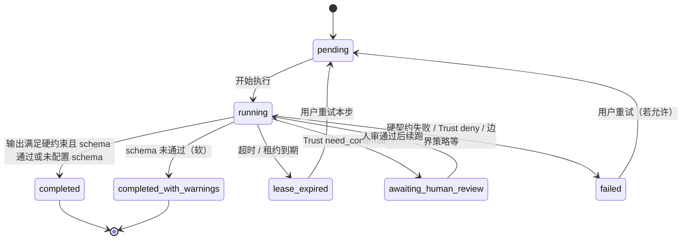

# 编排运行时产品语义 v1

> **来源**：`CTO-V1.3-Product-and-Web-Release-Spec-Supplement-v1.md` §17.1 D1–D7；**Epic**：E-14（V1.3.1）。  
> **用途**：统一引擎、API、收据/审计与前端进度展示对用户可见行为；与 `packages/server/docs/orchestration-runtime-protocol.md` 互补（协议偏技术字段，本文偏产品决策）。

---

## 1. 决策表（D1–D7）

| 序号 | 决策点 | **已定稿选择** | 说明 |
|------|--------|----------------|------|
| **D1** | 单步「完成」判定 | **A + B**：A2A 终态 `completed` 后，若本步配置了可选 `output_schema`（JSON Schema 子集），则再做契约校验；**校验失败不判失败**，步骤标为 `completed_with_warnings`，会话内下发系统提示，**后续步骤继续**（除非另有硬约束）。无 `output_schema` 时仍使用 `expected_output.required_fields` 做**硬**契约，违反则步骤 `failed`。 | 与质量轨/评测包挂钩时可在步骤上显式挂 schema；关键链路推荐配置 schema。 |
| **D2** | 步骤间数据流 | **结构化映射**：`orchestration_steps.input_mapping`（JSON）将上一步 `output_json` 的字段映射为模板占位符 `{{name}}`；兼容拓扑里的 `field_mapping`。`output_snapshot` 在步骤结束时写入**该步输出快照**（默认同 `output_json`）。**V1.3.1 不允许**用户在步骤间隙编辑中间稿（后续若开放须版本号 + 确认动作入审计）。 | 模板仍支持 `{{user_message}}`、`{{prev}}`（`prev` 为整份上步 JSON 字符串）。 |
| **D3** | 部分成功（multi-step partial success） | **策略 A**：已交付步骤结果**即时展示且不回滚**；后续步骤失败时 Run 终态 `partial_completed`，前序已完成步骤的 `output_json` / 消息保留。 | 与汇总卡片、帮助中心话术一致。 |
| **D4** | 单步超时 | **暂停 + 租约到期语义**：步骤级 `lease_expires_at` 与 `step_timeout_ms` 对齐；超时后步骤 `lease_expired`，Run `lease_expired`，用户可选择 **重试本步** / **放弃整链**（`abandon_run`）。**不**在 V1.3.1 自动重试；**换 Agent** 通过重新 `execute` 新拓扑或后续产品化 API，本版以重试同一步为主。 | 与 §5.1.3 `timeout` 一致；用户面文案强调「租约已到期」。 |
| **D5** | 重试语义 | **同一 `run_id`** 上重试本步时刷新 `run_id_per_step`（已有行为）；**新一次编排执行**产生新 `run_id`。配额/计费与 `run_id_per_step` / 调用次数对齐（与 §9 计量一致，不在本文展开公式）。 | 审计可通过 `orchestration.step.retry` 与 `run_id_per_step` 区分首次与重试。 |
| **D6** | 用户取消 | **正在执行的步骤**：`AbortSignal` 中断 A2A 请求（与现网一致）；**已排队步骤**：丢弃不执行。订阅型 B 类 Run 用户取消时**清除** `schedule_cron` / `next_run_at` 并不再被调度。 | 与会话 `closed` 交互无冲突：取消针对 Run。 |
| **D7** | 拓扑包 vs 官方动态拓扑 | **共用**同一套运行时语义；差异仅 **触发源**（`topology_source` + 是否带 `schedule_cron` / B 类调度）。 | 禁止双实现。 |

**CTO / 产品签字**：________________________ **日期**：________（实施以本表为准；签字页可另附 PDF。）

---

## 2. 用户可见状态机（步骤）

Run 级终态：`running`、`scheduled`（仅 B 类等待下次触发）、`awaiting_human_review`、`awaiting_user`（遗留，逐步由 `lease_expired` 收敛）、`lease_expired`、`paused_timeout`（遗留）、`completed`、`failed`、`partial_completed`、`canceled`。

---

## 3. 与审计 / 收据的字段映射（摘要）

| 用户可见概念 | 审计 event_type（示例） | 收据 / payload 关键字段 |
|--------------|-------------------------|-------------------------|
| 一步正常完成 | `orchestration.step.completed` | `run_id`、`step_index`、`run_id_per_step`、`message_id` |
| 一步带警告完成 | 同上（payload 可含 `schema_warnings`） | 同上 + `completed_with_warnings: true` |
| 租约到期 | `orchestration.step.failed`（reason 含 lease/timeout） | `run_id_per_step` |
| B 类一次触发 | `orchestration.run.*` 与步骤事件同 A 类 | Invocation Context：`invocation_source: scheduled`，`subscription_id` = run_id |

---

## 4. 帮助中心 FAQ（要点）

- **为什么停在第二步？** 可能失败、等待确认、或租约到期；Run 详情页展示当前步骤状态与原因码。  
- **部分完成了结果在哪？** 策略 A：前序步骤产生的内容仍在会话消息与对应步骤 `output_json` / `output_snapshot` 中，Run 标记 `partial_completed` 而非清空。

---

## 5. 修订记录

| 版本 | 日期 | 说明 |
|------|------|------|
| v1 | 2026-03-24 | E-14 首版定稿（D1–D7 填满 + 状态机） |
